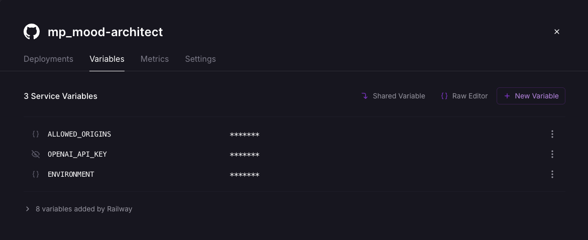
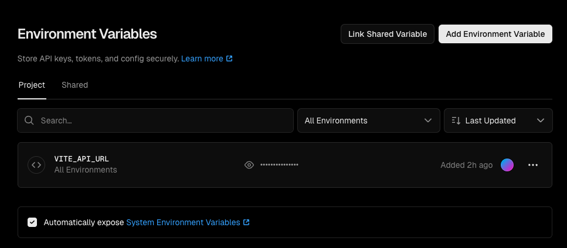

# Affirm Nation

A full-stack AI web app that generates personalized therapeutic affirmations based on a user's name and current feeling. Built with FastAPI and React.

**Live:** [Frontend](https://mp-mood-architect.vercel.app/) | [Backend](https://mpmood-architect-production.up.railway.app)

## Project Structure (Mono Repo)

```
mp_mood-architect/
├── backend/       # FastAPI + OpenAI
├── web-client/    # React + Vite + Tailwind
```

## How It Works

1. User enters their name and selects how they feel
2. Frontend sends a POST request to `/api/affirmation`
3. Backend constructs a prompt with safety guardrails and sends it to OpenAI
4. A personalized affirmation is returned and displayed

## Running Locally

Each project has its own README with detailed setup instructions:

- [Backend README](./backend/README.md) -- Poetry, Docker, environment config
- [Web Client README](./web-client/README.md) -- pnpm, Vite dev server

## Environment Variables

Both services require environment configuration. See each project's `.env.example` for reference.

Screenshot of hosting provider env var settings (values hidden):




## Next Steps / Improvements

- Add agent evaluation using [Opik](https://www.comet.com/site/products/opik/)
- Introduce rate limiting on the affirmation endpoint to prevent abuse
- Add unit and integration tests for both backend services and frontend components.
